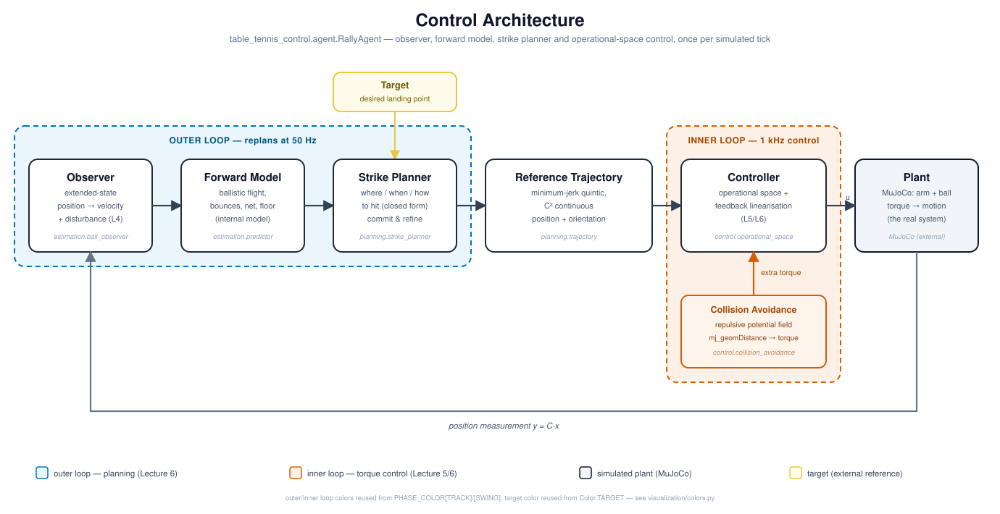

# Neuromorphic Control — Table Tennis Control Capstone Project

A simulated table-tennis robot that **observes** an incoming ball, **predicts**
where it will be, **plans** a stroke that returns it onto a chosen point of the
opponent's half, and **executes** that stroke with an operational-space
controller.

Inspired by Sony's *Ace* table-tennis robot [Dürr et al., "Outplaying elite
table tennis players with an autonomous robot," *Nature* 652, 886–891
(2026)], built for the *Introduction to Neuromorphic Control* capstone
project at Osnabrück University. Unlike Ace, which pairs event-based-vision
perception with a learned (deep-reinforcement-learning) control policy,
every component here — observer, forward model, planner, controller — is a
classical, model-based design.



---

## What it does

* A **launcher** serves realistic balls from the opponent's side: it picks a
  bounce point on the robot's half and inverts the ballistic flight for it, so
  every serve clears the net and is actually playable.
* An **extended-state observer** reconstructs the ball's velocity — and any
  unmodelled acceleration — from position measurements alone.
* A **forward model** rolls the ball forward through table bounces and the net.
* A **strike planner** searches the prediction for the interception the arm can
  reach soonest, and solves in closed form for the paddle pose and paddle
  velocity that send the ball to the target.
* The target always sits on the **floor beyond the opponent's half**, at a
  distance from the table that is guaranteed to be reachable (see *Target
  placement* below).
* Every return is a **normal rally shot**: the ball bounces exactly once on
  the opponent's half before reaching the target.
* A **minimum-jerk reference trajectory** takes the paddle through the
  interception with the required swing velocity and a follow-through.
* An **operational-space controller** with feedback linearisation tracks that
  reference; a **repulsive potential field** keeps the arm's links off the
  table and away from each other.
* Everything is drawn as an **overlay inside the MuJoCo window** — no second
  plot window, nothing that blocks the control loop.

---

## Installation

Requires Python ≥ 3.11.

```bash
python -m venv .venv
# Windows
.venv\Scripts\activate
# Linux / macOS
source .venv/bin/activate

pip install -e .
```

For the development extras (tests and linting):

```bash
pip install -e ".[dev]"
```

---

## Running

### Interactive simulation

```bash
ttc-sim
```

or, equivalently, without installing the console script:

```bash
python -m table_tennis_control
```

The MuJoCo viewer opens, the launcher starts serving and the robot plays. All
diagnostics — the predicted ball trajectory, the planned return and strike
point, the ball's actual path, the target, and the robot's current stroke
phase — are drawn inside that window. Rally statistics (serves, strikes,
landing error) print to the console once the run ends.

**Keys**

The viewer opens with the arm serving itself automatically. Every letter key
is already a native MuJoCo viewer shortcut (`p` = contact split, `t` =
transparent, ...) and MuJoCo's own handler fires alongside a custom one
rather than instead of it, so this project's own bindings live on the digits
6-9 instead, the one range confirmed free of a native meaning:

| Key | Action |
| --- | --- |
| `space` | serve now (only while auto-serve is off, see `9` below) |
| `6` | pause / resume |
| `7` | toggle the predicted/planned trajectory overlay |
| `8` | toggle the ball's actual-path trace |
| `9` | toggle auto-serve (on: serves by itself; off: `space` serves) |

**Useful options**

```bash
ttc-sim --seed 3                  # different reproducible serves/targets (default 37)
ttc-sim --speed 0.25              # quarter speed, to watch a stroke closely
ttc-sim --serve-interval 2.5      # serve more often
ttc-sim --sensor-delay 8          # stress the observer's delay compensation
ttc-sim --no-collision-avoidance  # switch the potential field off
ttc-sim --no-overlay              # drop the whole in-window overlay
ttc-sim --no-auto-serve           # serve manually with [space] instead
ttc-sim --debug-plots             # export one tracking/planning PNG per serve
```

Every run is reproducible by default (`--seed` defaults to 37). `ttc-sim --help`
lists everything.

### Rendering a video

```bash
ttc-render --duration 30 --output output/match.mp4
```

This runs the same agent head-less and writes an MP4 (via OpenCV, no external
`ffmpeg` needed) with the overlay baked in. Options mirror the interactive app
plus:

```bash
ttc-render --camera render_cam --width 1920 --height 1080 --fps 30
```

Available cameras: `render_cam` (default), `top_down`, `follow`.

### Tests

```bash
pytest
```

The suite covers the ballistics and the impact model, the observer and the
forward model, the return solver, the trajectory generator, the controller in
closed loop, and a short end-to-end rally.

For behavioural evaluation rather than correctness, `scripts/benchmark.py`
runs several seeds of a full headless rally session and reports strike rate,
on-target-half rate, net-clip rate, and mean/median landing error:

```bash
python scripts/benchmark.py --seeds 15 --duration 20
```

See `scripts/README.md` for the rest of the diagnostic tooling.

---

## How it works

The project is laid out along the control architecture of the lecture: a
slower outer loop observes, predicts and plans, and hands a smooth reference
down to a fast inner loop that tracks it with torque control.

```
                    ┌──────────────┐
    measurement ───►│   observer   │  position → velocity + disturbance
                    └──────┬───────┘  (extended state, Lecture 4)
                           ▼
                    ┌──────────────┐
                    │ forward model│  ballistic flight + table bounces
                    └──────┬───────┘  (internal model principle)
                           ▼
                    ┌──────────────┐
                    │strike planner│  where / when / how to hit
                    └──────┬───────┘  (outer loop, 50 Hz, Lecture 6)
                           ▼
                 reference trajectory
                           ▼
        ┌────────────────────────────────────────┐
        │ operational space  feedback lin.  null │  inner loop, 1 kHz
        └──────────────────┬─────────────────────┘  (Lecture 5/6)
                           ▼
                        MuJoCo plant
```

### Observer (`table_tennis_control.estimation.ball_observer`)

The controller never reads the ball's velocity out of the simulator. It gets
a position measurement and reconstructs both velocity and an unmodelled
disturbance acceleration with a Luenberger observer whose three poles all
sit at the same location, so there's a single bandwidth knob to tune. That
disturbance estimate is exactly what active disturbance rejection would
cancel; here it's fed forward into the forward model instead. `--sensor-delay`
lets you see the delay compensation work (validated up to at least 8 control
steps with no measurable accuracy cost). Artificial measurement noise is not
supported: this is a fixed-gain observer, not a Kalman filter, so noise gets
amplified straight into the estimate rather than filtered out.

### Return solver (`table_tennis_control.planning.return_solver`)

For a standard return the ball has to touch the opponent's half at some point
and *then* reach the target on the floor beyond it. Eliminating the paddle's
exit velocity between the two ballistic arcs turns this into a small,
closed-form algebra problem instead of a numerical search — sweeping a small
grid of candidate post-bounce flight times enumerates the whole family of
legal returns directly, fully vectorised over every candidate interception
point. `solve_bounce_return` is written generally enough to bounce on
*either* half (the parameter is `bounce_side`); which of the two legs is
checked for net clearance follows from that choice, since only one of them
ever crosses the net.

### Impact model (`table_tennis_control.physics`)

The ball/paddle restitution (`ε ≈ 0.90`) and the tangential damping
(`μ ≈ 0.91`) were measured directly in the simulator rather than assumed.
Since the paddle only ever needs to move along its own face normal, the
impact model inverts in closed form: given the incoming ball velocity and the
desired outgoing one, the required paddle normal and speed follow directly —
friction included, no iterative solve needed.

### Planning and commitment (`table_tennis_control.planning.strike_planner`, `table_tennis_control.agent`)

Candidate interceptions are scored by how long the arm needs to get there
(closed-form minimum-jerk peak velocity/acceleration), the required paddle
speed and how early the ball can be met. The naive version of this keeps
postponing the stroke — every replanning cycle a slightly later interception
looks cheapest, and the ball drops untouched. Two things prevent that:

1. while the ball still has to bounce, the arm only **pre-positions** towards
   where the ball will cross the strike zone;
2. as soon as the remaining flight is a single ballistic arc the **instant** of
   the impact is locked, and later cycles only correct *where* the ball will be
   at that instant. The swing keeps its duration and merely bends a little.

The strike zone sits behind the robot's baseline, so the arm plays from behind
the table like a human would and never has to reach across the play surface.

The swing trajectory itself is frozen `PlannerConfig.commit_horizon` (0.22 s)
before impact: freezing earlier (a longer horizon) locks in a staler, less
accurate prediction, which shows up as the arm visibly overshooting and
correcting right as the ball arrives, and can trigger a second, corrective
swing attempt at the same ball. A shorter horizon (0.08 s) was tried during a
competitive-speed (12-25 m/s) stress test, but at those speeds it made strike
rate measurably worse once combined with the other loosened margins that
test needed, so 0.22 s stays the default.

### Target placement (`table_tennis_control.world.target`)

The target is always a floor point behind the opponent's half. Its distance
from the table is sampled as a *margin past the table's back edge*
(`TargetConfig.floor_margin_range`, default 1.0–2.2 m), not as an absolute
coordinate — a point only a few centimetres behind the edge would force the
return onto a near-vertical drop that clips the tabletop on the way down,
which is why targets used to occasionally be unreachable. Deriving the range
from `TableSpec.half_length` keeps every sampled target geometrically clear of
the table regardless of the table's dimensions.

### Controller (`table_tennis_control.control`)

The torque command combines three terms. A feedback-linearised PD law tracks
the reference position and orientation: MuJoCo's own gravity/Coriolis
compensation (`qfrc_bias`) cancels out the arm's own dynamics, so what's left
behaves like a unit mass in task space, and the gains are chosen critically
damped for a clean, non-oscillating response. A dynamically consistent
null-space posture term then uses the arm's redundancy to hold a natural
elbow pose without disturbing the tracked task — getting that projector's
ordering wrong was a real bug in an earlier version, and visibly dragged the
paddle orientation around. And the collision-avoidance force described below
is injected directly into the same torque command, on top of the other two.
The orientation task itself only aligns the paddle's face normal; rotation
about the face is physically irrelevant to the stroke and is left free for
the posture term to use instead.

### Collisions

The arm links carry (invisible, massless) capsule collision geometry.
Collision bitmasks let the links collide with the table, the ground and each
other — but never with the ball — except for links directly joined to one
another, which are explicitly excluded (they'd otherwise sit in constant
spurious contact at the shared joint); enable geom group 3 in the viewer to
see the proxies. On top of that hard contact, a repulsive potential field
pushes links away from the table/ground and from each other *before* they
touch, evaluated with `mj_geomDistance` and mapped to joint torques at the
witness point. A few non-adjacent pairs that sit permanently close together
by construction (`CollisionConfig.self_collision_excludes`) are exempted
from that soft, pre-emptive push and rely on the hard contact alone.
`--no-collision-avoidance` turns the potential field off if you want to
watch what it was preventing.

---

## Layout

```
src/table_tennis_control/
    config.py           every tunable number of the project
    physics.py          ballistics, bounce and impact models (vectorised)
    kinematics.py       rotation helpers
    agent.py            the rally agent and its state machine
    world/               MuJoCo scene, ball, target, ball launcher
    estimation/         extended-state observer, forward model
    planning/           return solver, strike planner, reference trajectories
    control/            operational-space control, collision avoidance
    visualization/      in-scene overlay and per-serve debug plots
    apps/               the two command line applications
    assets/             world.xml and the meshes
tests/                  pytest suite
scripts/                benchmark harness and diagnostic tooling
docs/                   architecture diagram (more design notes to follow)
```

Everything you might want to tune lives in `src/table_tennis_control/config.py`:
table and ball properties, arm limits and the strike zone, controller gains,
the potential field, observer bandwidth, planner weights, launcher ranges and
the overlay.

---

## Known limitations

* The ball is modelled without spin, so the paddle is treated as frictionless
  along its face beyond the measured tangential damping. A real stroke would
  use spin.
* A handful of non-adjacent arm-link pairs that sit permanently close
  together by construction (`CollisionConfig.self_collision_excludes`) are
  exempted from the soft potential-field self-collision avoidance and rely
  on real MuJoCo contact as the backstop instead of pre-emptive avoidance.
* The robot plays one ball at a time — there is no rally against a returning
  opponent.

## AI assistance

Claude (Anthropic) was used to rewrite the module/function docstrings from
earlier, cruder versions into their current form, and to help write this
README, the project's other documentation, the `tests/` suite, and the
architecture diagram. AI assistance was also used for debugging: a number of
issues in this project were diagnosed and fixed with Claude's help after we
weren't able to resolve them on our own.

## Authors

Samuel Galla and Tim Huber — Institute of Cognitive Science, Osnabrück
University.
